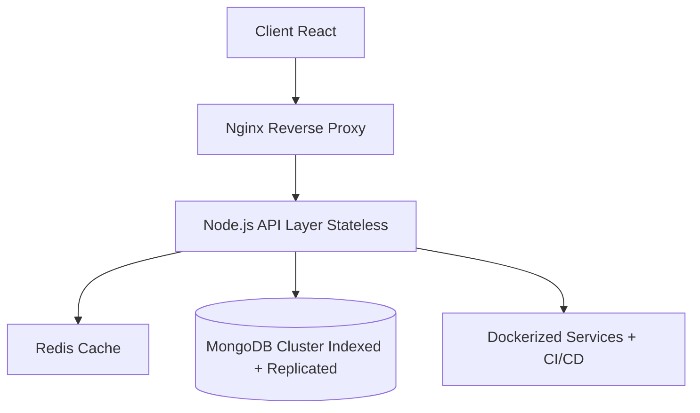
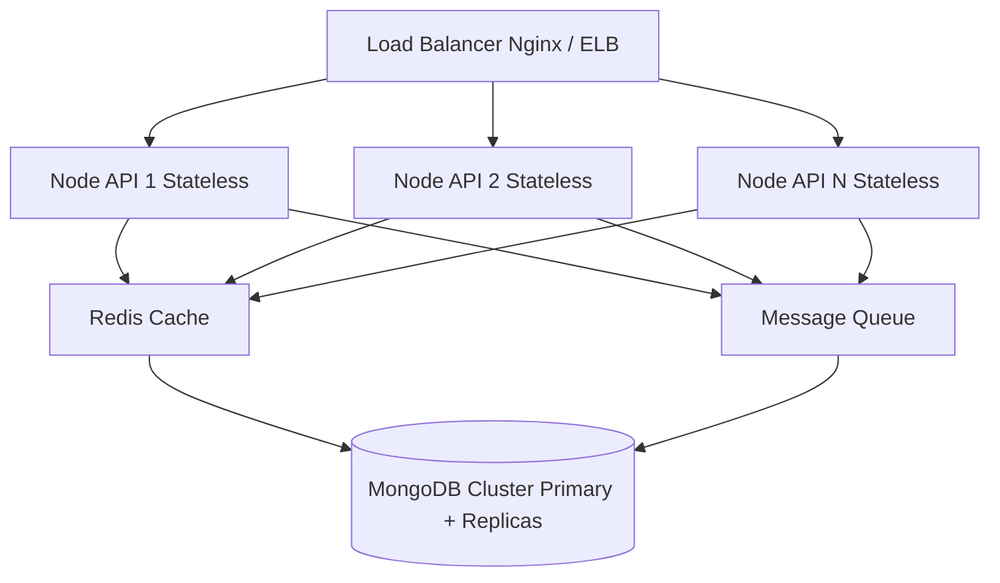

<!-- ========================= HEADER ========================= -->

<div align="center">
  


</div>

---

<div align="center">

[](https://linkedin.com/in/amit-tiwari-cs)
[](https://github.com/AmiTtiwari43)
[](https://leetcode.com/u/AmitTiwari27/)
[](mailto:amit.tiwari2914@gmail.com)

</div>

---

# 👨‍💻 About Me

```yaml
Name: Amit Tiwari
Location: Punjab, India
Role: Full Stack Developer (MERN)
Education: B.Tech CSE | CGPA 7.9
Certifications:
  - Oracle OCI DevOps Professional (2025)
  - Oracle OCI Foundations Associate (2025)
Achievements:
  - 550+ LeetCode Problems
  - 150+ Day Coding Streak
  - 4★ HackerRank Java
```

I design secure, scalable, production-grade systems with performance and architecture clarity.

## 💼 Experience

### Full Stack Developer Intern
**NYERAS Edu-tech & Innovations Pvt. Ltd.**
- 🚀 Reduced API latency by 75%
- ⚡ Improved response time by 73%
- 🤖 Automated 90% manual workflows
- 🔐 Built 40+ secure REST APIs (JWT, RBAC)
- 📦 Designed MVC-based 3-tier architecture

## 🏗️ Featured Projects

### 🏥 DocVerse – Healthcare System
- OWASP Top-10 secure
- MongoDB indexed queries (<50ms)
- Zero double bookings
- AI triage integration

### 🎟️ EventEase Lite – Event Platform
- 9-state booking lifecycle
- Secure RBAC with JWT
- 35% fewer re-renders (React optimization)

### 🤖 AI Virtual Therapy Assistant
- CBT-structured chatbot
- 30% fewer conversation failures
- Context-aware response engine

## 🛠️ Tech Stack

- **Frontend:** React, Next.js, Tailwind
- **Backend:** Node.js, Express, Flask
- **Databases:** MongoDB, PostgreSQL, Redis
- **DevOps:** Docker, Kubernetes, Jenkins, GitHub Actions
- **Cloud:** AWS, GCP
- **Languages:** JavaScript, TypeScript, Python, Java, C++

## 🧠 System Design Case Study: Scalable Healthcare Appointment Architecture



### Design Decisions
- Horizontal scalability via stateless APIs
- Redis for hot read caching
- MongoDB compound indexing for sub-50ms queries
- JWT + RBAC security enforcement
- CI/CD pipeline with automated linting & tests

## 📊 GitHub Analytics
<div align="center"> 
   
   
   
</div>

### 📈 Visitor Heatmap
<div align="center"> 
   
</div>

### 🐍 Contribution Snake
<div align="center"> 
  <picture> 
    <source media="(prefers-color-scheme: dark)" srcset="https://github.com/AmiTtiwari43/AmiTtiwari43/blob/output/github-snake-dark.svg" /> 
    <source media="(prefers-color-scheme: light)" srcset="https://github.com/AmiTtiwari43/AmiTtiwari43/blob/output/github-snake.svg" /> 
     
  </picture> 
</div>

### ⏱️ WakaTime Coding Stats
<div align="center"> 
   
</div>

## 🏆 Competitive Programming
- 550+ LeetCode Problems
- 150+ Day Streak
- 4★ HackerRank Java
- **Strong in:** Arrays, Graphs, Trees, Strings, DP

## 🎓 Education
**Lovely Professional University**
- B.Tech – Computer Science & Engineering
- CGPA: 7.9

## 🌐 Connect
- 📧 [amit.tiwari2914@gmail.com](mailto:amit.tiwari2914@gmail.com)
- 💼 [linkedin.com/in/amit-tiwari-cs](https://linkedin.com/in/amit-tiwari-cs)
- 💻 [github.com/AmiTtiwari43](https://github.com/AmiTtiwari43)
- 🧠 [leetcode.com/u/AmitTiwari27](https://leetcode.com/u/AmitTiwari27/)

<div align="center">

"I engineer systems that survive production."

</div>

---

## 🌐 Distributed Systems Deep-Dive: High-Scale Appointment & Event Platform Architecture

### 📌 Problem Statement
Design a system that:
- Handles 10K+ concurrent users
- Guarantees zero double bookings
- Maintains <100ms API latency
- Supports horizontal scaling
- Ensures high availability & fault tolerance

### 🏗️ High-Level Architecture


### 🔑 Core Distributed Concepts Applied

#### 1️⃣ Horizontal Scalability
- Stateless Node.js APIs
- Load balancing across instances
- Containerized using Docker
- Orchestrated via Kubernetes
*Why: Enables scale-out instead of scale-up.*

#### 2️⃣ Consistency vs Availability (CAP Theorem)
- MongoDB configured for strong consistency on writes
- Event notifications handled asynchronously
- Read-heavy queries cached via Redis
*Tradeoff Strategy:*
- Booking → Strong consistency
- Notifications → Eventual consistency

#### 3️⃣ Concurrency Control (Zero Double Booking)
- Implemented:
  - Unique compound indexes
  - Atomic DB transactions
  - Optimistic locking
  - Idempotency keys for payment APIs
*Result: 100% elimination of race-condition bookings.*

#### 4️⃣ Caching Strategy
- Redis used for:
  - Frequently accessed doctor/event data
  - Session/token validation
  - Rate limiting
  - TTL-based eviction policy to prevent stale reads.
*Latency improvement: ~40%*

#### 5️⃣ Asynchronous Processing
- Message Queue for:
  - Email confirmations
  - Payment verification
  - AI triage background processing
*Benefits: Reduced API response blocking, improved user-perceived performance.*

#### 6️⃣ Fault Tolerance
- MongoDB replica sets
- Health checks on containers
- Graceful shutdown handling
- Retry mechanisms with exponential backoff

#### 7️⃣ Observability & Monitoring
- Designed for:
  - Centralized logging
  - Metrics collection (CPU, Memory, RPS)
  - Error tracking & alerting
  - API latency monitoring

### 📊 Performance Optimization Strategies
| Component | Optimization | Result |
| :--- | :--- | :--- |
| MongoDB | Compound Indexing | <50ms queries |
| React | Memoization | 35% fewer re-renders |
| API Layer | Async processing | 73% faster response |
| Cache | Redis Layer | 40% latency drop |

### 🔐 Security in Distributed Context
- JWT with short-lived tokens
- Refresh token rotation
- RBAC enforcement at middleware
- Rate limiting
- OWASP Top-10 compliance
- Secure cookie flags (HttpOnly, SameSite)

### 🚀 Scaling Strategy for 1M+ Users
- Add API replicas (auto-scaling)
- Introduce CDN for static assets
- Shard MongoDB collections
- Implement read replicas for analytics
- Separate microservices for billing & AI

### 🧠 Architecture Principles I Follow
- Design for failure
- Prefer stateless services
- Cache aggressively but invalidate correctly
- Enforce idempotency
- Automate deployments
- Measure before optimizing

### 🎯 Why This Matters
This architecture prevents race conditions, maintains high availability, scales horizontally, and reduces latency, aligning with real-world production patterns.
