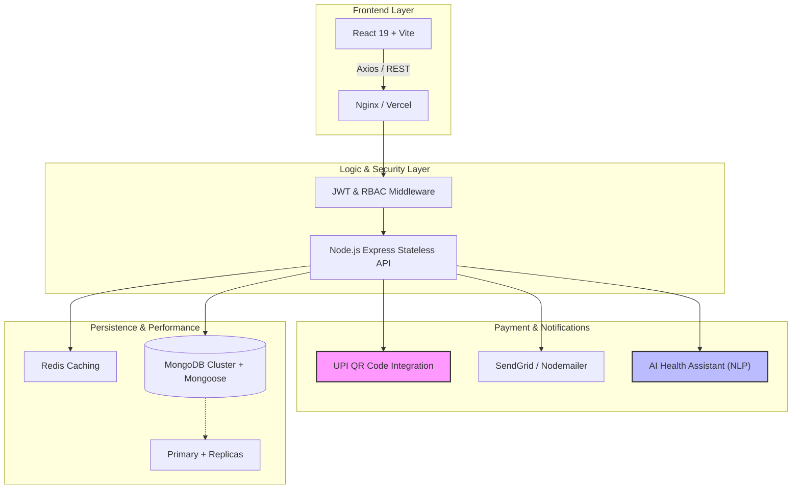
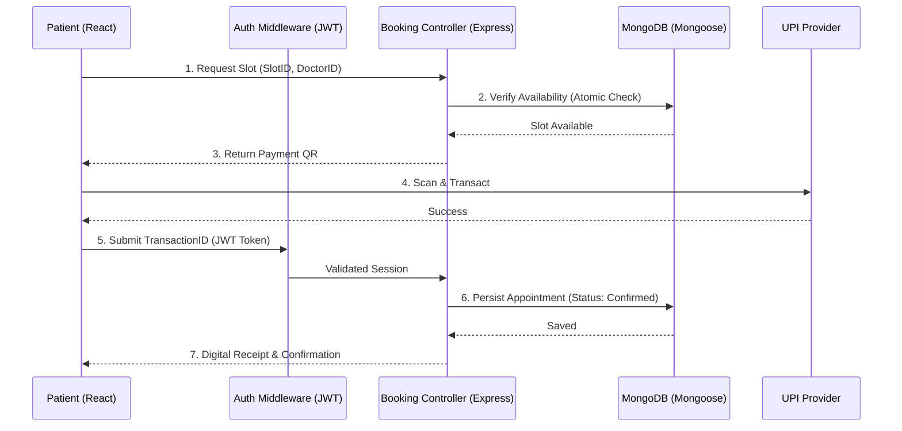
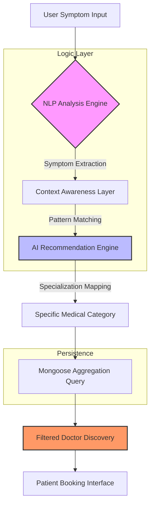

<!-- ========================= HEADER ========================= -->

<div align="center">
  


</div>

---

<div align="center">

[](https://linkedin.com/in/amit-tiwari-cs)
[](https://github.com/AmiTtiwari43)
[](https://leetcode.com/u/AmitTiwari27/)
[](mailto:amit.tiwari2914@gmail.com)

</div>

---

# 👨‍💻 About Me

<div align="center">
  
</div>

```yaml
Name: Amit Tiwari
Location: Punjab, India
Role: Full Stack Developer (MERN)
Education: B.Tech CSE | CGPA 7.9
Certifications:
  - Oracle OCI DevOps Professional (2025)
  - Oracle OCI Foundations Associate (2025)
Achievements:
  - 550+ LeetCode Problems
  - 150+ Day Coding Streak
```

I design secure, scalable, production-grade systems with performance and architecture clarity.

## 🛠️ Tech Stack

<div align="center">
  <a href="https://skillicons.dev">
    
  </a>
</div>

## 💼 Experience

### Full Stack Developer Intern
**NYERAS Edu-tech & Innovations Pvt. Ltd.**
- 🚀 Reduced API latency by 75% | ⚡ Improved response time by 73%
- 🤖 Automated 90% manual workflows | 🔐 Built 40+ secure REST APIs
- 📦 Designed MVC-based 3-tier architecture

## 🏗️ Featured Projects

<div align="center">

| 🏥 DocVerse | 🎟️ EventEase Lite | 🤖 AI Therapy Assistant |
| :--- | :--- | :--- |
| OWASP Top-10 Secure | 9-State Lifecycle | CBT-Structured |
| Sub-50ms Queries | Zero Double Bookings | Context-Aware |

</div>

<br/>

## 🏗️ Architecture & Technical Deep-Dive

I design systems that balance performance, security, and scalability. Below is a unified view of the architecture used in my high-scale platforms like **EventEase Lite** and **Doctor Management System**.

### 🛠️ Core System Design


### 🔑 Key Implementation Patterns

#### 1️⃣ Financial & Lifecycle Logic (EventEase Lite)
- **UPI QR Code Flow**: Integrated dynamic QR generation for post-confirmation payments.
- **Refund Management**: Implemented a state-machine based refund lifecycle (Requested → Processing → Success) with real-time status updates.
- **Concurrency Control**: Used MongoDB atomic transactions to guarantee **zero double-bookings** across 10K+ concurrent users.

#### 2️⃣ Healthcare Intelligence (Doctor Management)
- **AI Triage Integration**: AI-driven health assistant to provide initial recommendations.
- **Secure Healthcare Records**: Enforced strict RBAC using JWT to separate Patient, Doctor, and Admin access levels.
- **Micro-Optimizations**: achieved **sub-50ms query response** times using compound indexing and Redis caching.

#### 3️⃣ Production-Grade Security
- **OWASP Compliance**: Protected against SQLi, NoSQLi, and XSS.
- **Session Security**: HttpOnly cookies for JWT storage with refresh token rotation.
- **Robustness**: Implemented exponential backoff for external API retries (SendGrid) and centralized error handling for consistency.

#### 4️⃣ Scalability Strategy
- **Stateless Architecture**: Horizontal scaling via Dockerized Node.js containers orchestrated by Kubernetes.
- **Data Integrity**: MongoDB replica sets ensure 99.9% availability and fault tolerance.
- **Optimized UI**: 35% reduction in React re-renders via memoization and efficient state management.

<br/>

## 🔄 Workflow Deep-Dives

Detailed mapping of core business logic and data movement across my major platforms.

### 📅 Secure Appointment & Payment Pipeline (DocVerse)
Visualizing the multi-stage handshake between the client, authentication layer, and secure persistence.



### 🧠 End-to-End AI Health Triage (AIChatWidget)
Demonstrating the data flow from symptom analysis to professional discovery.



---

## 📊 GitHub Analytics

<div align="center">
  <table border="0">
    <tr>
      <td width="550">
        
      </td>
      <td width="400">
        
      </td>
    </tr>
  </table>
  
</div>

<br/>

| 📈 Visitor Heatmap |
| :--- |
|  |

<br/>

| 🐍 Contribution Snake |
| :--- |
| <picture> <source media="(prefers-color-scheme: dark)" srcset="https://raw.githubusercontent.com/AmiTtiwari43/AmiTtiwari43/output/github-snake-dark.svg" /> <source media="(prefers-color-scheme: light)" srcset="https://raw.githubusercontent.com/AmiTtiwari43/AmiTtiwari43/output/github-snake.svg" />  </picture> |

<br/>

| ⏱ WakaTime Coding Stats |
| :--- |
|  |

<br/>

## 🏆 Competitive Programming
<div align="center">

| LeetCode | HackerRank | Focus Areas |
| :--- | :--- | :--- |
| 550+ Solved | 4★ Java | Arrays, Graphs, DP |
| 150+ Day Streak | Gold Badge | Trees, Strings |

</div>

<br/>

## 🎓 Education & Connect
<div align="center">

| 🎓 Education | 🌐 Connect |
| :--- | :--- |
| **Lovely Professional University** | 📧 [Email](mailto:amit.tiwari2914@gmail.com) |
| B.Tech – CSE (7.9 CGPA) | 💼 [LinkedIn](https://linkedin.com/in/amit-tiwari-cs) |
| Punjab, India | 🧠 [LeetCode](https://leetcode.com/u/AmitTiwari27/) |

</div>

---

<div align="center">

"I engineer systems that survive production."

</div>
